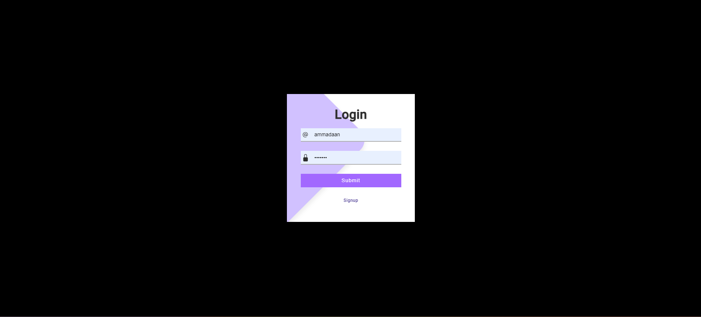
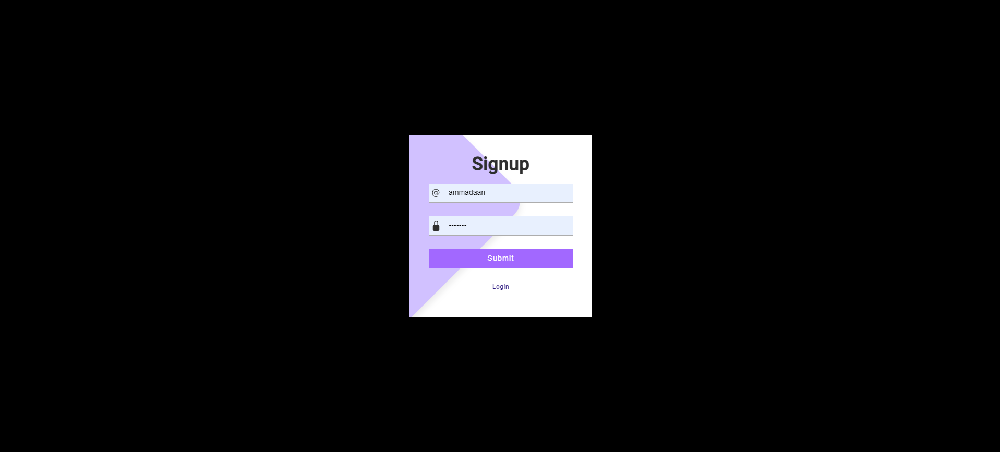
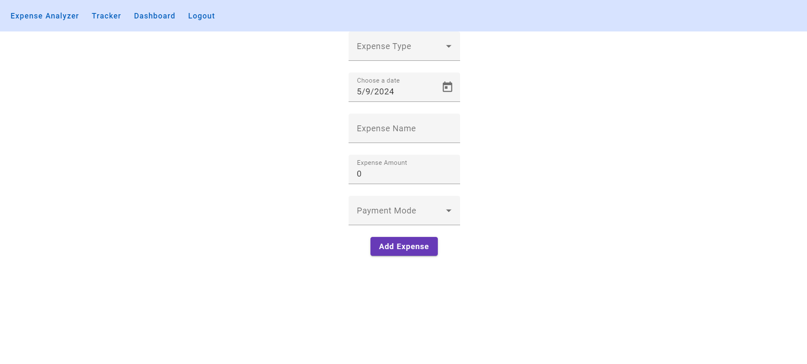
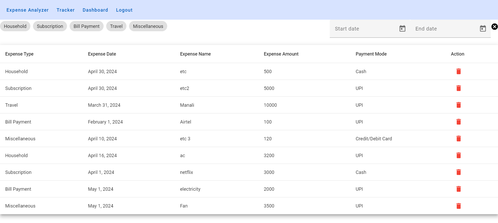
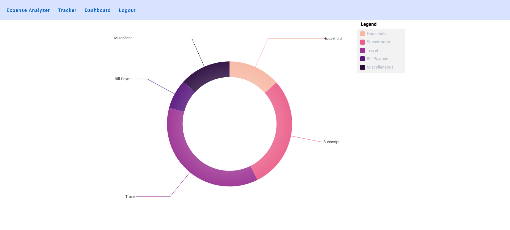

# Expense Analyzer

Expense Analyzer is a web application designed to help users manage and track their expenses efficiently. It provides features like adding expenses, filtering them based on date range and expense type, visualizing expenses through charts, and managing user authentication.

## Technologies Used
- Frontend: Angular
- Backend: Node.js
- Database: MongoDB

## Features
1. **User Authentication:**
   - Users can log in or sign up to access the application.

2. **Add Expense:**
   - Users can add expenses with the following details:
     - Expense Type (Dropdown)
     - Expense Date (Datepicker)
     - Expense Name (Input)
     - Expense Amount (Number Field)
     - Expense Mode (Dropdown)

3. **Expense Tracker:**
   - Displays a table of entered expenses.
   - Supports filtering by date range and expense type.
   - Allows users to delete specific expenses.

4. **Expense Visualization:**
   - Provides a doughnut chart to visualize expenses by expense type.

5. **Logout Functionality:**
   - Users can log out, which redirects them to the login page.

## Backend APIs
- `/login`: Logs in the user.
- `/signup`: Creates a new user.
- `/save-expense`: Saves an expense.
- `/get-expenses`: Retrieves all expenses of the logged-in user.
- `/delete-expense`: Deletes a specific expense.

## Setup Instructions
1. Clone the repository.
2. Navigate to the backend directory and run `npm install` to install backend dependencies.
3. Set up MongoDB and configure the connection in the backend.
4. Run the backend server using `npm start`.
5. Navigate to the frontend directory and run `npm install` to install frontend dependencies.
6. Configure backend API endpoints in the frontend.
7. Run the frontend server using `ng serve`.

## Usage
1. Open the application in your browser.
2. Log in or sign up to access the main features.
3. Add expenses through the "Add Expense" page.
4. View and manage expenses in the "Expense Tracker" page.
5. Visualize expenses using the doughnut chart on the "Expense Visualization" page.
6. Log out when done using the application.

## Screens
## Screenshots
1. Login Page

2. Signup Page

3. Add Expense Page

4. Expense Tracker Page

5. Expense Visualization Page
